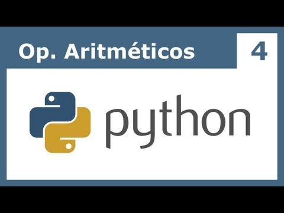
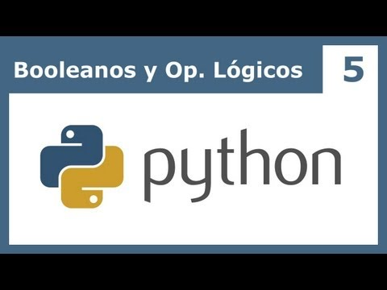
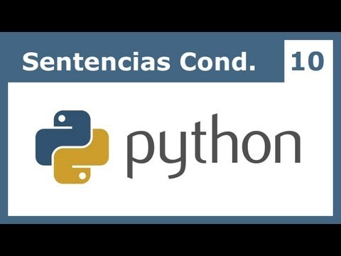
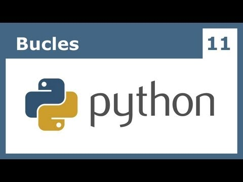
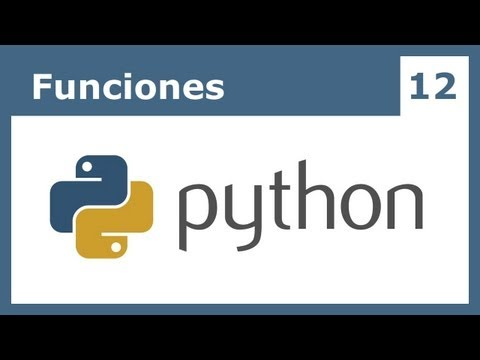
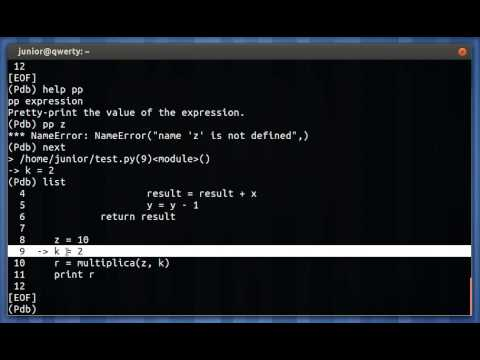
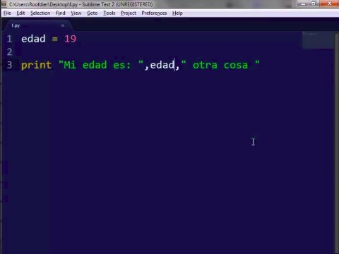
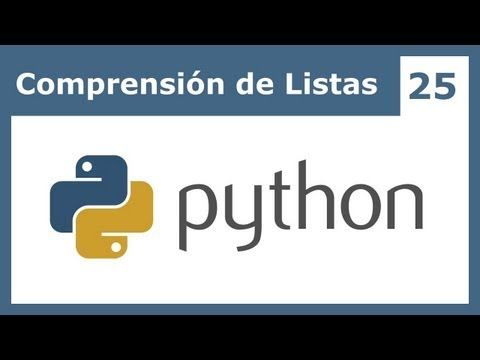
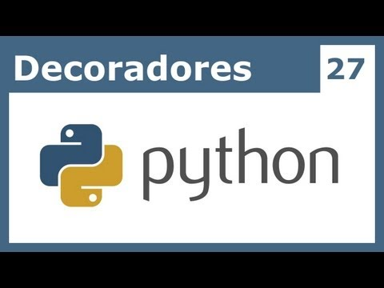

.. -*- coding: utf-8 -*-

.. _anexos_entrenamiento:

Anexos del entrenamiento
========================

A continuación varios material multimedia anexos a las lecciones del entrenamiento:

.. _anexos_CjmzDHMHxwU:

    Vídeo `Tutorial Python 1 - Introducción al Lenguaje de Programación <https://www.youtube.com/watch?v=CjmzDHMHxwU>`_,
    cortesía de `CodigoFacilito.com`_.

.. _anexos_VTykmPa2KY:

.. figure:: ../_images/youtube/VTykmP-a2KY.jpg
    :align: center
    :scale: 60%
    :width: 60%

    Vídeo `Tutorial Python 2 - Instalación <https://www.youtube.com/watch?v=VTykmP-a2KY>`_, cortesía de `CodigoFacilito.com`_.

.. _anexos_OtJEj7N9T6k:

    Vídeo `Tutorial Python 3 - Hola Mundo <https://www.youtube.com/watch?v=OtJEj7N9T6k>`_, cortesía de `CodigoFacilito.com`_.

.. _anexos_ssnkfbBbcuw:

    Vídeo `Tutorial Python 4 - Enteros, reales y operadores aritméticos <https://www.youtube.com/watch?v=ssnkfbBbcuw>`_, cortesía de `CodigoFacilito.com`_.

.. _anexos_ZrxcqbFYjiw:

    Vídeo `Tutorial Python 5 - Booleanos, operadores lógicos y cadenas <https://www.youtube.com/watch?v=ZrxcqbFYjiw>`_,
    cortesía de `CodigoFacilito.com`_.

.. _anexos_hLqKvB7tGWk:

    Vídeo `Tutorial Python 10 - Sentencias condicionales <https://www.youtube.com/watch?v=hLqKvB7tGWk>`_, cortesía de `CodigoFacilito.com`_.

.. _anexos_IyI2ZuOq_xQ:

    Vídeo `Tutorial Python 11 - Bucles <https://www.youtube.com/watch?v=IyI2ZuOq_xQ>`_, cortesía de `CodigoFacilito.com`_.

.. _anexos__C7Uj7O5o_Q:

    Vídeo `Tutorial Python 12 - Funciones <https://www.youtube.com/watch?v=_C7Uj7O5o_Q>`_, cortesía de `CodigoFacilito.com`_.

.. _anexos_N4NtB4r28h0:

    Vídeo `Depurando um programa Python com pdb - Python Debugger <https://www.youtube.com/watch?v=N4NtB4r28h0>`_, cortesía de *Youtube*.

.. _anexos_AzeUCuMvW6I:

    Vídeo `Tutorial Python 30 - Entrada Estándar rawInput <https://www.youtube.com/watch?v=AzeUCuMvW6I>`_, cortesía de `CodigoFacilito.com`_.

.. _anexos_JPXgxK3Oc:

    Vídeo `Tutorial Python 31 - Salida Estándar rawInput <https://www.youtube.com/watch?v=B-JPXgxK3Oc>`_, cortesía de `CodigoFacilito.com`_.

.. _anexos_VYXdpjCZojA:

    Vídeo `Tutorial Python 13 - Clases y Objetos <https://www.youtube.com/watch?v=VYXdpjCZojA>`_, cortesía de `CodigoFacilito.com`_.

.. _anexos_87s8XQbUv1k:

    Vídeo `Tutorial Python 25 - Comprensión de Listas <https://www.youtube.com/watch?v=87s8XQbUv1k>`_, cortesía de `CodigoFacilito.com`_.

.. _anexos_tvHbC_OZV14:

    Vídeo `Tutorial Python 26 - Generadores <https://www.youtube.com/watch?v=tvHbC_OZV14>`_, cortesía de `CodigoFacilito.com`_.

.. _anexos_TaIWx9paNIA:

    Vídeo `Tutorial Python 27 - Decoradores <https://www.youtube.com/watch?v=TaIWx9paNIA>`_, cortesía de `CodigoFacilito.com`_.
