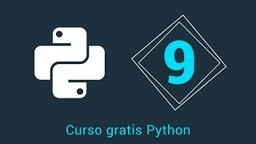
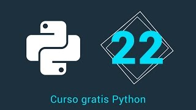

.. -*- coding: utf-8 -*-

.. _anexos_entrenamiento:

Anexos del entrenamiento
========================

A continuación varios material multimedia anexos a las lecciones del entrenamiento:

.. _anexos_mGH1uooFhGs:

    Vídeo `1.- Curso Python - Introducción <https://www.youtube.com/watch?v=mGH1uooFhGs>`_,
    cortesía de `CodigoFacilito.com`_.

.. _anexos_Sk59ji0hZFg:

    Vídeo `2.- Curso Python - Instalación <https://www.youtube.com/watch?v=Sk59ji0hZFg>`_, cortesía de `CodigoFacilito.com`_.

.. _anexos_vDa5Vt002IY:

    Vídeo `3.- Curso Python - Variables <https://www.youtube.com/watch?v=vDa5Vt002IY>`_, cortesía de `CodigoFacilito.com`_.

.. _anexos_9YaC2_GdmJ8:

.. figure:: ../_static/images/youtube/9YaC2_GdmJ8.jpg
    :target: https://www.youtube.com/watch?v=9YaC2_GdmJ8
    :align: center

    Vídeo `4.- Curso Python - Enteros <https://www.youtube.com/watch?v=9YaC2_GdmJ8>`_, cortesía de `CodigoFacilito.com`_.

.. _anexos_ZqGynv-wgWg:

    Vídeo `5.- Curso Python - Strings <https://www.youtube.com/watch?v=ZqGynv-wgWg>`_, cortesía de `CodigoFacilito.com`_.

.. _anexos_XefbjfEDN-U:

    Vídeo `6.- Curso Python - Strings como listas <https://www.youtube.com/watch?v=XefbjfEDN-U>`_, cortesía de `CodigoFacilito.com`_.

.. _anexos_I1a7piALq60:

    Vídeo `7.- Curso Python - Métodos de cadenas <https://www.youtube.com/watch?v=I1a7piALq60>`_, cortesía de `CodigoFacilito.com`_.

.. _anexos_sQ9iP7HhYJo:

    Vídeo `8.- Curso Python - Listas <https://www.youtube.com/watch?v=sQ9iP7HhYJo>`_, cortesía de `CodigoFacilito.com`_.

.. _anexos_DI8IHc3V-HQ:

    Vídeo `9.- Curso Python - Tuplas <https://www.youtube.com/watch?v=DI8IHc3V-HQ>`_, cortesía de *Youtube*.

.. _anexos__UELgsIxE7g:

    Vídeo `10.- Curso Python - Diccionarios <https://www.youtube.com/watch?v=_UELgsIxE7g>`_, cortesía de `CodigoFacilito.com`_.

.. _anexos_BJXCnAd6pdM:

    Vídeo `11.- Curso Python - Condicionales <https://www.youtube.com/watch?v=BJXCnAd6pdM>`_, cortesía de `CodigoFacilito.com`_.

.. _anexos_u6Hqs0bL_Ew:

    Vídeo `12.- Curso Python - While <https://www.youtube.com/watch?v=u6Hqs0bL_Ew>`_, cortesía de `CodigoFacilito.com`_.

.. _anexos_aqnjB3dydik:

    Vídeo `13.- Curso Python - For <https://www.youtube.com/watch?v=aqnjB3dydik>`_, cortesía de `CodigoFacilito.com`_.

.. _anexos_Z-8Khdd2BUQ:

    Vídeo `14.- Curso Python - List Comprehension <https://www.youtube.com/watch?v=Z-8Khdd2BUQ>`_, cortesía de `CodigoFacilito.com`_.

.. _anexos_hF85etcCghY:

.. figure:: ../_static/images/youtube/hF85etcCghY.jpg
    :target: https://www.youtube.com/watch?v=hF85etcCghY
    :align: center

    Vídeo `15.- Curso Python - Funciones parte 1 <https://www.youtube.com/watch?v=hF85etcCghY>`_, cortesía de `CodigoFacilito.com`_.

.. _anexos_vMTV0hY2jio:

    Vídeo `16.- Curso Python - Funciones parte 2 <https://www.youtube.com/watch?v=vMTV0hY2jio>`_, cortesía de `CodigoFacilito.com`_.

.. _anexos_munC0mVXPWk:

.. figure:: ../_static/images/youtube/munC0mVXPWk.jpg
    :target: https://www.youtube.com/watch?v=munC0mVXPWk
    :align: center

    Vídeo `17.- Curso Python - Variables Globales <https://www.youtube.com/watch?v=munC0mVXPWk>`_, cortesía de `CodigoFacilito.com`_.

.. _anexos_PeWKpuFpGZA:

    Vídeo `18.- Curso Python - Argumentos <https://www.youtube.com/watch?v=PeWKpuFpGZA>`_, cortesía de `CodigoFacilito.com`_.

.. _anexos_cJ9zcR1uTt8:

.. figure:: ../_static/images/youtube/cJ9zcR1uTt8.jpg
    :target: https://www.youtube.com/watch?v=cJ9zcR1uTt8
    :align: center

    Vídeo `19.- Curso Python - Lambdas <https://www.youtube.com/watch?v=cJ9zcR1uTt8>`_, cortesía de `CodigoFacilito.com`_.

.. _anexos_S0Lfm_rEQ2A:

    Vídeo `20.- Curso Python - Funciones Anidadas <https://www.youtube.com/watch?v=S0Lfm_rEQ2A>`_, cortesía de `CodigoFacilito.com`_.

.. _anexos_c9J7FHLjBds:

    Vídeo `21.- Curso Python - Decoradores <https://www.youtube.com/watch?v=c9J7FHLjBds>`_, cortesía de `CodigoFacilito.com`_.

.. _anexos_536fB1qvSeE:

    Vídeo `22.- Curso Python - Generadores <https://www.youtube.com/watch?v=536fB1qvSeE>`_, cortesía de `CodigoFacilito.com`_.

.. _anexos_2KL-mJ4n1k4:

    Vídeo `23.- Curso Python - Docstring <https://www.youtube.com/watch?v=2KL-mJ4n1k4>`_, cortesía de `CodigoFacilito.com`_.

.. _anexos__4QUMUlI2S8:

    Vídeo `24.- Curso Python - Módulo <https://www.youtube.com/watch?v=_4QUMUlI2S8>`_, cortesía de `CodigoFacilito.com`_.

.. _anexos_S0wU4tqP6Bs:

    Vídeo `25.- Curso Python - Módulos Parte 2 <https://www.youtube.com/watch?v=S0wU4tqP6Bs>`_, cortesía de `CodigoFacilito.com`_.

.. _anexos_t4Vsv8WAnUM:

    Vídeo `26.- Curso Python - Estructura Módulo <https://www.youtube.com/watch?v=t4Vsv8WAnUM>`_, cortesía de `CodigoFacilito.com`_.

.. _anexos_yTvw1dVcER8:

    Vídeo `27.- Curso Python - Name <https://www.youtube.com/watch?v=yTvw1dVcER8>`_, cortesía de `CodigoFacilito.com`_.

.. _anexos_44D-QCg-YEw:

    Vídeo `28.- Curso Python - Librerías <https://www.youtube.com/watch?v=44D-QCg-YEw>`_, cortesía de `CodigoFacilito.com`_.

.. _anexos_l7Aj6RhJx8g:

    Vídeo `29.- Curso Python - Argv <https://www.youtube.com/watch?v=l7Aj6RhJx8g>`_, cortesía de `CodigoFacilito.com`_.

.. _anexos_sNTowPB4YHI:

    Vídeo `30.- Curso Python - Excepciones <https://www.youtube.com/watch?v=sNTowPB4YHI>`_, cortesía de `CodigoFacilito.com`_.

.. _anexos_vdz9HGfFguc:

    Vídeo `31.- Curso Python - Clases y Objetos <https://www.youtube.com/watch?v=vdz9HGfFguc>`_, cortesía de `CodigoFacilito.com`_.
