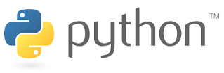
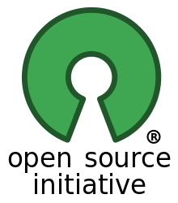
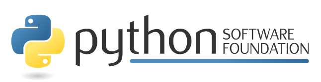
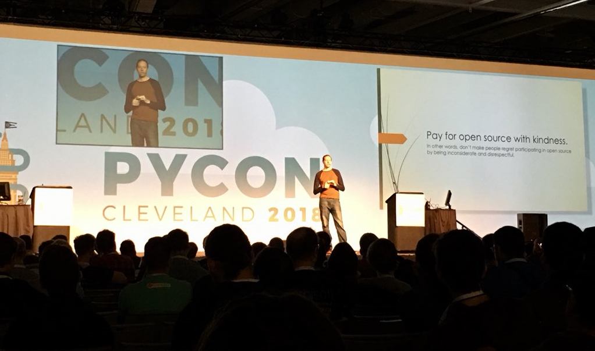

.. -*- coding: utf-8 -*-

.. _python_intro:

Acerca de Python
----------------

Python es un lenguaje de programación de propósito general muy poderoso y flexible, 
a la vez que sencillo y fácil de aprender. Es un lenguaje de alto nivel, que permite 
procesar fácilmente todo tipo de estructuras de datos, tanto numéricos como de texto.

    Lenguaje de programación Python.

Este lenguaje fue creado a principios de los noventa por 
`Guido van Rossum <https://es.wikipedia.org/wiki/Guido_van_Rossum>`_ en los Países 
Bajos. 

.. figure:: ../_static/Guido_van_Rossum_2006.jpg
    :align: center
    :width: 40%

    Guido van Rossum en 2006.

Es relativamente joven (Fortran 1957, Pascal 1970, C 1972, Modula-2 1978, Java 
1991). Toma características de lenguajes predecesores, incluso, compatibilizando la 
solución de varios de ellos. Por ejemplo, habilita tres formas de imprimir el valor de 
una variable: desde el entorno interactivo escribiendo su nombre (como en Basic), usando 
la función ``print``, con concatenación de elementos (al estilo del ``write`` de Pascal) 
o bien con patrones de formato (al estilo del ``printf`` de C).

Es software libre, y está implementado en :ref:`todas las plataformas <python_multiplataforma>` 
y sistemas operativos habituales.

.. _python_open_source:

Open source
...........

Python se desarrolla bajo una licencia de Open source o código abierto aprobada por OSI, 
por lo que se puede usar y distribuir libremente, incluso para uso comercial. 

    Logotipo de la Open Source Initiative.

La licencia 
de Python es administrada por :ref:`Python Software Foundation <python_psf>`.

- `Aprenda más sobre la licencia <https://docs.python.org/license.html>`_.

- `Licencia Python en OSI <http://opensource.org/licenses/Python-2.0>`_.

- `Conozca más sobre la Fundación <https://www.python.org/psf-landing/>`_.

.. _python_psf:

Python Software Foundation
~~~~~~~~~~~~~~~~~~~~~~~~~~

La Python Software Foundation (PSF) es una corporación sin fines de lucro 501 (c) (3) que 
posee los derechos de propiedad intelectual detrás del lenguaje de programación Python. 
Administramos las licencias de código abierto para Python versión 2.1 y posteriores, y 
poseemos y protegemos las marcas comerciales asociadas con Python. 

    Python Software Foundation.

También realiza la conferencia PyCon de Norteamérica anualmente, apoyamos otras conferencias 
de Python en todo el mundo y financiamos el desarrollo relacionado con Python con nuestro 
`programa de subvenciones <https://www.python.org/psf/grants/>`_ y financiamos proyectos 
especiales.

    *La misión de Python Software Foundation es promover, proteger y avanzar el lenguaje 
    de programación Python, y apoyar y facilitar el crecimiento de una comunidad* 
    `diversa <https://www.python.org/psf/diversity/>`_ *e internacional de programadores 
    de Python.*

    —De la `página de la Declaración de la Misión <https://www.python.org/psf/mission/>`_.

.. note:: Mayor información consulte https://www.python.org/psf/

.. _python_aplicaciones:

Aplicaciones
............

El `Python Package Index (PyPI) <https://pypi.org/>`_ o en español significa *Índice de 
paquetes de Python* alberga miles de módulos de terceros para Python.

.. figure:: ../_static/landing_about.png
    :align: center
    :width: 70%

    Aplicaciones están disponibles en el Python Package Index (PyPI).

Tanto la biblioteca estándar de Python como los módulos aportados por la comunidad 
permiten infinitas posibilidades.

- `Desarrollo web e Internet <https://www.python.org/about/apps/#web-and-internet-development>`_.

- `Acceso a la base de datos <https://www.python.org/about/apps/#database-access>`_.

- `GUIs de escritorio <https://www.python.org/about/apps/#desktop-guis>`_.

- `Científico y numérico <https://www.python.org/about/apps/#scientific-and-numeric>`_.

- `Educación <https://www.python.org/about/apps/#education>`_.

- `Programación de red <https://www.python.org/about/apps/#network-programming>`_.

- `Desarrollo de Software y Juegos <https://www.python.org/about/apps/#software-development>`_.

.. _python_comunidad:

Comunidad
.........

El gran software es soportado por grandes personas. La base de usuarios es entusiasta, dedicada 
a fomentar el uso del lenguaje y comprometida a que sea diversa y amigable.

    Comunidad Python reunidad en la PyCon 2018 in Cleveland, Ohio.

Declaración de Diversidad
~~~~~~~~~~~~~~~~~~~~~~~~~

La :ref:`Python Software Foundation <python_psf>` y la comunidad a nivel mundial de Python dan 
la bienvenida y fomentan la participación de todos. La comunidad se basa en el respeto mutuo, 
la tolerancia y el aliento, y estamos trabajando para ayudarnos mutuamente a cumplir con estos 
principios. Queremos que nuestra comunidad sea más diversa: sea quien sea, y cualquiera sea su 
experiencia, le damos la bienvenida.

.. note:: Mayor información consulte https://www.python.org/community/diversity/

Listas de correo
~~~~~~~~~~~~~~~~

Existen listas de correo de Python y grupos de noticias como recursos de la comunidad. Estos recursos 
están disponibles públicamente de python.org, y son usando como un canal de información o discusión 
sobre ideas nuevas, e incluso históricamente como otra vía soporte en linea.

Ademas hay la guía de recursos de Python que no están en inglés, que incluye listas de correo, 
documentación traducida y original que no está en inglés, y otros recursos.

.. note:: Mayor información consulte https://www.python.org/community/lists/

Internet Relay Chat - IRC
~~~~~~~~~~~~~~~~~~~~~~~~~

Existen muchos canales relacionados con Python en la red Internet Relay Chat (IRC) de Freenode. Todos 
los canales esta disponibles en el servidor de IRC en `Freenode <http://freenode.net/>`_. Para 
conectarse al servidor IRC use *irc.freenode.net* o puede usar la 
`interfaz web de chat IRC de Freenode <https://webchat.freenode.net/>`_.

Para preguntas cortas, usted puede obtener ayuda inmediata visitando el canal ``#python``. Usted 
necesitará registrar su apodo con FreeNode, usando la guiá de 
`instrucciones para registrar apodo <http://freenode.net/kb/answer/registration>`_.

.. note:: Mayor información consulte https://www.python.org/community/irc/

Foros
~~~~~

Existe algunos recursos disponibles en formato de Foros, a continuación se listan:

- `Python Forum (English) <https://python-forum.io/>`_.

- `Python-Forum.de (German) <https://www.python-forum.de/>`_.

- `/r/learnpython (English) <https://www.reddit.com/r/learnpython/>`_.

Si usted esta buscando un foro nativo en su idioma, por favor, consulte la pagina de los grupos 
locales en la `Wiki de Python <https://wiki.python.org/moin/>`_.

.. _python_comunidades_locales:

Comunidades locales
~~~~~~~~~~~~~~~~~~~

Siendo Python un proyecto :ref:`Open source <python_open_source>` el cual es mantenido por 
toda una gran comunidad de usuarios y desarrolladores a nivel mundial, la cual ofrece soporte 
comunitario del proyecto Python en Sudamérica.

**Comunidad(es) de Python en Argentina**
    Nuestro objetivo es nuclear a los usuarios de Python. Pretendemos llegar a personas y 
    empresas, promover el uso de Python e intercambiar información. Más información 
    visite http://www.python.org.ar/

**Comunidad(es) de Python en Brasil**
    La comunidad Python Brasil reúne grupos de usuarios en todo el Brasil interesados en 
    difundir e divulgar a lenguaje de programación. Más información visite https://python.org.br

**Comunidad(es) de Python en Chile**
    Una comunidad de amigos apasionados por la tecnología e informática, que busca compartir 
    conocimiento de forma libre y sin fines de lucro, con el fin de fortalecer a los miembros 
    de la comunidad para generar un impacto positivo en la región. Más información visite 
    https://pythonchile.cl/comunidad/

**Comunidad(es) de Python en Colombia**
    Somos una comunidad enfocada en extender en el territorio nacional el uso y aprendizaje de 
    las distintas tecnologías Python y sus numerosas aplicaciones. Más información visite 
    https://www.python.org.co/

**Comunidad(es) de Python en Ecuador**
    Somos una comunidad independiente, conformada por entusiastas de Python, con la filosofía 
    común de que el conocimiento debe ser libre. No lucramos con ningún evento, y esperamos 
    llegar a todos aquellos que desean aprender. Más información visite https://pythonecuador.org/

**Comunidad(es) de Python en Perú**
    Comunidad de estudiantes, profesionales e interesados en tener un espacio donde conversar, 
    preguntar e intercambiar ideas todo acerca del lenguaje de programación Python. Más 
    información visite https://www.meetup.com/es/pythonperu/

**Comunidad(es) de Python en Paraguay**
    Las comunidades de Python están presentes en todo el mundo, con el objeto de apoyar a los 
    usuarios de este lenguaje y difundirlo. En Paraguay lo conforman un grupo de entusiastas 
    de Python, que creemos que podemos sumar ganas y esfuerzo para lograr difundir y ayudar a 
    toda aquella persona que se interese por Python a crecer dentro del sus interés. Entre las 
    funciones de la comunidad organizamos eventos de distinto tipo para difundir el lenguaje, 
    desde PyDay, meetup hasta simples reuniones para comentar ideas y experiencias. Más 
    información visite https://pythonpy.org

**Comunidad(es) de Python en Uruguay**
    Para más información visite https://python.uy

**Comunidad(es) de Python en Venezuela**
    La Fundación Python de Venezuela (FPyVE) es una organización sin fines de lucro creada 
    el 2 de febrero de 2015 dedicada a fomentar al lenguaje de programación Python. El objetivo 
    principal es el desarrollo, ejecución y/o consultoría de proyectos científicos, tecnológicos 
    y productivos, para cumplir fines de interés público en torno al desarrollo Nacional, haciendo 
    uso y promoviendo para tal fin, el uso del lenguaje de programación Python y las tecnologías 
    asociadas a éste. Más información visite http://pyve.github.io/

----

.. seealso::

    Consulte la sección de :ref:`lecturas suplementarias <lectura_extras_sesion1>` 
    del entrenamiento para ampliar su conocimiento en esta temática.
