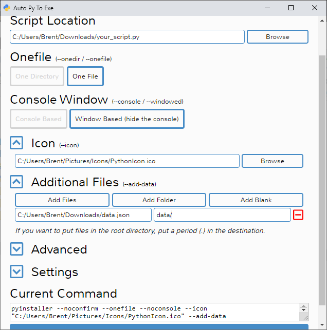
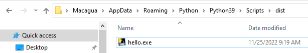

.. -*- coding: utf-8 -*-

.. _python_distribucion_nativa:

Distribución nativa
-------------------

A menudo, necesitarás compartir tu aplicación con muchos usuarios. Más adelante
deberás actualizar la aplicación y querrás asegurarte de que puedes hacerlo de
forma que tus usuarios no técnicos no tengan problemas y que sea fácil para ti.

A diferencia de la :ref:`distribución binaria <python_distro_crear_bdist>`,
la distribución nativa se refiere a al instalador nativo al sistema operativo.
Este instalador pudiera o no, incluir un archivo binario que compile todo el
software generado en sus proyecto, incluir las dependencias de las librerías
externas a la :ref:`librería estándar <python_libreria_estandar>` de Python.

A continuación se presentan algunos casos librerías que pueden cumplir con
esta función:

.. _python_pkg_autopytoexe:

Paquete auto-py-to-exe
......................

El paquete `auto-py-to-exe <https://pypi.org/project/auto-py-to-exe/>`_ le permite
convertir archivos ``.py`` a archivos ``.exe`` usando una simple interfaz gráfica
de usuario para sistemas operativos Windows/Mac OS X.

A continuación el siguiente comando le permite instalarlo:

.. code-block:: console

    $ pip install auto-py-to-exe

Para ejecutar el programa, ejecute el siguiente comando:

.. code-block:: console

    $ auto-py-to-exe

Al ejecutar el comando previo, debe mostrarle la siguiente interfaz de usuario.

Aquí puede definir lo siguiente:

- Elegir si es un archivo o un directorio.

- Elegir si se ejecuta por consola de comando básica o por consola de Windows (Ocultar consola).

- Elegir si personaliza el icono de la aplicación.

- Elegir si incluye archivos de data.

- Elegir la configuración avanzada.

    auto-py-to-exe con la interfaz vacía.

Seguidamente rellene la interfaz indicando el modulo python que requiere generarle
el instalador, y personalice los parámetros su necesidad.

    auto-py-to-exe con la interfaz configurada.

Aquí puede definir lo siguiente:

- Elegir si incluye archivos de data.

- Elegir si incluye directorio de de la aplicación.

- Elegir opciones avanzadas:

    - Opciones generales.

    - Que debe agrupar, donde lo debe buscar.

    - Como generar el ``.exe``

    - Opciones especificas de *Windows/Mac OS X*.

    - Opciones especificas de *Windows*.

    - Opciones de búsqueda de ensamblaje en paralelo para *Windows* (avanzadas).

    - Opciones especificas de *Mac OS X*.

    - Opciones especiales raramente usadas.

    - Otros argumentos.

Luego después de configurar la interfaz, presione el botón ``Convert .py to .exe``

    auto-py-to-exe ejecutando la conversion.

El ejecutar el proceso de conversion se realizan varias tareas para generar el .exe

    auto-py-to-exe completo el proceso de la conversion.

Al finalizar el proceso de la conversion, le indica el resultado de la tarea, si presiona
el botón **"Open Output Folder"** accedes al directorio de generación del archivo ``.exe``.

.. _python_pkg_pyinstaller:

Paquete pyinstaller
...................

El paquete `pyinstaller <https://pypi.org/project/pyinstaller/>`_ le permite
agrupar una aplicación de Python y todas sus dependencias en un solo paquete.

A continuación el siguiente comando le permite instalarlo:

.. code-block:: console

    $ pip install pyinstaller

Supongamos que tiene el siguiente código:

.. literalinclude:: ../../recursos/leccion8/hello.py
    :language: python
    :linenos:
    :lines: 1-12

Plataforma Windows
^^^^^^^^^^^^^^^^^^

Para generar la distribución nativa del modulo ``hello.py`` para plataformas Windows,
ejecute el siguiente comando:

.. code-block:: console

    > pyinstaller.exe --onefile hello.py

El comando anterior muestra la siguiente salida en la consola de comando:

.. code-block:: console

    5392 INFO: PyInstaller: 5.6.2
    5393 INFO: Python: 3.9.13 (conda)
    5416 INFO: Platform: Windows-10-10.0.19045-SP0
    5417 INFO: wrote C:\Users\Macagua\AppData\Roaming\Python\Python39\Scripts\hello.spec
    5463 INFO: UPX is not available.
    5475 INFO: Extending PYTHONPATH with paths
    ['C:\\Users\\Macagua\\AppData\\Roaming\\Python\\Python39\\Scripts']
    9994 INFO: checking Analysis
    9994 INFO: Building Analysis because Analysis-00.toc is non existent
    9995 INFO: Initializing module dependency graph...
    10008 INFO: Caching module graph hooks...
    10273 INFO: Analyzing base_library.zip ...
    29637 INFO: Loading module hook 'hook-encodings.py' from 'C:\\Users\\Macagua\\AppData\\Roaming\\Python\\Python39\\site-packages\\PyInstaller\\hooks'...
    38757 INFO: Loading module hook 'hook-pickle.py' from 'C:\\Users\\Macagua\\AppData\\Roaming\\Python\\Python39\\site-packages\\PyInstaller\\hooks'...
    41365 INFO: Loading module hook 'hook-heapq.py' from 'C:\\Users\\Macagua\\AppData\\Roaming\\Python\\Python39\\site-packages\\PyInstaller\\hooks'...
    45568 INFO: Caching module dependency graph...
    45922 INFO: running Analysis Analysis-00.toc
    46022 INFO: Adding Microsoft.Windows.Common-Controls to dependent assemblies of final executable
    required by C:\ProgramData\Anaconda3\python.exe
    47305 INFO: Analyzing C:\Users\Macagua\AppData\Roaming\Python\Python39\Scripts\hello.py
    47305 INFO: Processing module hooks...
    47336 INFO: Looking for ctypes DLLs
    47336 INFO: Analyzing run-time hooks ...
    47336 INFO: Including run-time hook 'C:\\Users\\Macagua\\AppData\\Roaming\\Python\\Python39\\site-packages\\PyInstaller\\hooks\\rthooks\\pyi_rth_subprocess.py'
    47400 INFO: Looking for dynamic libraries
    5334 INFO: Extra DLL search directories (AddDllDirectory): []
    5335 INFO: Extra DLL search directories (PATH): ['C:\\Program Files (x86)\\Common Files\\Oracle\\Java\\javapath', 'C:\\Windows\\system32', 'C:\\Windows', 'C:\\Windows\\System32\\Wbem', 'C:\\Windows\\System32\\WindowsPowerShell\\v1.0\\', 'C:\\Windows\\System32\\OpenSSH\\', 'C:\\Program Files\\Microsoft VS Code\\bin', 'C:\\Program Files\\Git\\cmd', 'C:\\Program Files\\PuTTY\\', 'C:\\Program Files\\Meld\\', 'C:\\Users\\Macagua\\AppData\\Local\\Microsoft\\WindowsApps', 'C:\\ProgramData\\Anaconda3', 'C:\\ProgramData\\Anaconda3\\Scripts', 'C:\\ProgramData\\Anaconda3\\Library\\bin', 'C:\\ProgramData\\Anaconda3\\Library\\usr\\bin']
    54417 INFO: Looking for eggs
    54417 INFO: Using Python library C:\ProgramData\Anaconda3\python39.dll
    54417 INFO: Found binding redirects:
    []
    54432 INFO: Warnings written to C:\Users\Macagua\AppData\Roaming\Python\Python39\Scripts\build\hello\warn-hello.txt
    54508 INFO: Graph cross-reference written to C:\Users\Macagua\AppData\Roaming\Python\Python39\Scripts\build\hello\xref-hello.html
    54614 INFO: checking PYZ
    54614 INFO: Building PYZ because PYZ-00.toc is non existent
    54629 INFO: Building PYZ (ZlibArchive) C:\Users\Macagua\AppData\Roaming\Python\Python39\Scripts\build\hello\PYZ-00.pyz
    55203 INFO: Building PYZ (ZlibArchive) C:\Users\Macagua\AppData\Roaming\Python\Python39\Scripts\build\hello\PYZ-00.pyz completed successfully.
    55218 INFO: checking PKG
    55218 INFO: Building PKG because PKG-00.toc is non existent
    55218 INFO: Building PKG (CArchive) hello.pkg
    60512 INFO: Building PKG (CArchive) hello.pkg completed successfully.
    60517 INFO: Bootloader C:\Users\Macagua\AppData\Roaming\Python\Python39\site-packages\PyInstaller\bootloader\Windows-64bit\run.exe
    60517 INFO: checking EXE
    60518 INFO: Building EXE because EXE-00.toc is non existent
    60519 INFO: Building EXE from EXE-00.toc
    60540 INFO: Copying bootloader EXE to C:\Users\Macagua\AppData\Roaming\Python\Python39\Scripts\dist\hello.exe.notanexecutable
    61087 INFO: Copying icon to EXE
    61141 INFO: Copying icons from ['C:\\Users\\Macagua\\AppData\\Roaming\\Python\\Python39\\site-packages\\PyInstaller\\bootloader\\images\\icon-console.ico']
    61257 INFO: Writing RT_GROUP_ICON 0 resource with 104 bytes
    61257 INFO: Writing RT_ICON 1 resource with 3752 bytes
    61259 INFO: Writing RT_ICON 2 resource with 2216 bytes
    61261 INFO: Writing RT_ICON 3 resource with 1384 bytes
    61262 INFO: Writing RT_ICON 4 resource with 37019 bytes
    61265 INFO: Writing RT_ICON 5 resource with 9640 bytes
    61266 INFO: Writing RT_ICON 6 resource with 4264 bytes
    61266 INFO: Writing RT_ICON 7 resource with 1128 bytes
    61272 INFO: Copying 0 resources to EXE
    61273 INFO: Embedding manifest in EXE
    61275 INFO: Updating manifest in C:\Users\Macagua\AppData\Roaming\Python\Python39\Scripts\dist\hello.exe.notanexecutable
    61415 INFO: Updating resource type 24 name 1 language 0
    61421 INFO: Appending PKG archive to EXE
    61438 INFO: Fixing EXE headers
    64723 INFO: Building EXE from EXE-00.toc completed successfully.

De esta forma genera dentro de la carpeta ``dist`` la distribución binaria ``hello.exe`` del modulo ``hello.py``.

    distribución binaria hello.exe generada.

Puede ejecutar distribución binaria ``hello.exe`` generada, el cual mostrara la siguiente pantalla.

    distribución binaria hello.exe ejecutada.

Asi de esta forma genera una distribución nativa para plataformas Windows.

Plataforma Linux
^^^^^^^^^^^^^^^^

Para generar la distribución nativa del modulo ``hello.py`` para plataformas Linux,
ejecute el siguiente comando:

.. code-block:: console

    $ pyinstaller --onefile hello.py

Asi de esta forma genera una distribución nativa para plataformas Windows.

----

.. seealso::

    Consulte la sección de :ref:`lecturas suplementarias <lectura_extras_leccion8>`
    del entrenamiento para ampliar su conocimiento en esta temática.
