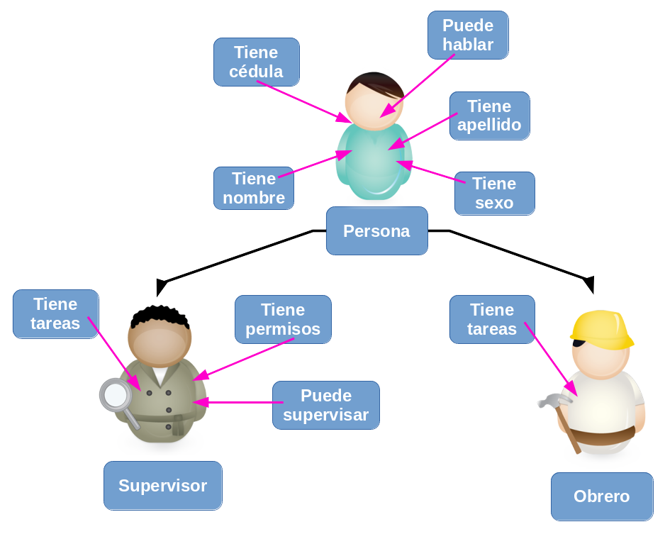

.. -*- coding: utf-8 -*-

.. _python_poo_herencia:

Herencia
--------

La herencia es una de las premisas y técnicas de la :ref:`POO <python_poo>` 
la cual permite a los programadores crear una clase general primero y luego 
más tarde crear clases más especializadas que re-utilicen código de la clase 
general. La herencia también le permite escribir un código más limpio y legible.

.. _python_poo_clase_base:

Clase Base
..........

Clase Base o también conocida como *Clase abstracta* le permite definir una 
clase que puede heredarse en otras clases los atributos y comportamientos 
definido en esta.

.. figure:: ../_static/clase_abstracta.png
    :align: center
    :width: 70%

    Clase base o abstracta

Use el diagrama anterior para ilustrar el concepto de la herencia, vea el caso de 
dos clases que tiene algo en común, ambas son personas, con atributos de datos 
personales y comportamiento tipicos como hablar, comer, caminar, entonces para eso 
se crea una clase base llamada ``Persona``. A continuación un ejemplo de la clase 
``Persona`` con un método interno:

.. literalinclude:: ../../recursos/leccion9/herencia_simple.py
    :linenos:
    :language: python
    :lines: 3-32

En el ejemplo previo, es donde empieza a crear una clase (lo hace con la 
palabra ``class``). La segunda palabra ``Persona`` es el nombre de la clase. 
La tercera palabra que se encuentra dentro de los paréntesis este hace referencia 
al :ref:`objeto object <python_objeto_object>`, usando para indicar la clase de 
la cual precede.

La clase ``Persona`` tiene los métodos ``__init__``, ``__str__``, ``hablar`` 
y ``getSexo``. Sus atributos son ``cedula``, ``nombre``, ``apellido`` y ``sexo``. 

La instancia de dos nuevos objetos ``Persona`` seria de la siguiente forma:

.. literalinclude:: ../../recursos/leccion9/herencia_simple.py
    :linenos:
    :language: python
    :lines: 59-60

El método constructor ``__init__`` es un método especial el cual debe escribir 
como: ``MiClase(parámetros iniciales si hay cualquiera)``.

Usted puede invocar esos métodos y atributos con la siguiente notación: 
``claseinstancia.metodo`` o ``claseinstancia.atributo``. 

.. literalinclude:: ../../recursos/leccion9/herencia_simple.py
    :linenos:
    :language: python
    :lines: 63

El método ``__str__`` es un método usando para imprimir la descripción de la 
instancia de objeto el cual debe mostrar como:

.. literalinclude:: ../../recursos/leccion9/herencia_simple.py
    :linenos:
    :language: python
    :lines: 69

En el anterior código se usan para cierto formato para imprimir la instancia de 
objeto usando la sentencia ``print``, concatenando el carácter ``\n`` para 
generar un salto de página y seguidamente convertir a formato cadena de caracteres 
usando la función ``str()`` a la instancia de objeto llamada ``persona2``. 

.. _python_poo_herencia_simple:

Herencia simple
...............

La herencia simple se apoya en el uso de :ref:`clases base <python_poo_clase_base>` 
para compartir sus atributos y comportamientos con otros clases derivadas como los 
siguiente ejemplos el objeto ``Supervisor`` y el objeto ``Obrero``.

    Diagrama de herencia de Objetos

El siguiente es un ejemplo de la clase ``Supervisor`` 
que derivada de la clase ``Persona`` con función interna:

.. literalinclude:: ../../recursos/leccion9/herencia_simple.py
    :linenos:
    :language: python
    :lines: 35-56

Ahora, se creará una nueva clase ``Supervisor`` con los mismos métodos y atributos 
como la clase ``Persona``, pero con dos nuevos atributos ``permisos`` y ``tareas``. 
No se copia la clase previa, pero si **se hereda** de ella.

La instancia del nuevo objeto ``Supervisor`` seria de la siguiente forma:

.. literalinclude:: ../../recursos/leccion9/herencia_simple.py
    :linenos:
    :language: python
    :lines: 79

Luego que generá la instancia del nuevo objeto ``Supervisor`` llamada ``supervisor1`` 
se puede imprimir sus detalles de la siguiente forma:

.. literalinclude:: ../../recursos/leccion9/herencia_simple.py
    :linenos:
    :language: python
    :lines: 80

Si desea usar los métodos de la clase ``Supervisor`` se puede imprimir de la siguiente forma:

.. literalinclude:: ../../recursos/leccion9/herencia_simple.py
    :linenos:
    :language: python
    :lines: 81-82

Como la instancia de objeto ``supervisor1`` hereda los métodos de la clase ``Persona`` 
usted puede reusarlo e invocarlo de la siguiente forma:

.. literalinclude:: ../../recursos/leccion9/herencia_simple.py
    :linenos:
    :language: python
    :lines: 84-85

Gracias a las clases y la programación orientada a objetos, usted puede organizar 
el código con diferentes clases correspondientes a diferentes objetos que encontrará 
(una clase ``Persona``, una clase ``Carro``, una clase ``Departamento``, etc.), con sus 
propios métodos y atributos. Luego puede usar la herencia para considerar las variaciones 
en torno a una clase base y reutilizar el código. Ej.: a partir de una clase base de 
``Persona``, usted puede crear clases derivadas como ``Supervisor``, ``Profesor``, ``Obrero``, 
etc.

.. literalinclude:: ../../recursos/leccion9/herencia_simple.py
    :linenos:
    :language: python
    :lines: 89-92

.. important::
    Usted puede descargar el código usado en esta sección haciendo clic 
    :download:`aquí <../../recursos/leccion9/herencia_simple.py>`.

.. tip::
    Para ejecutar el código :file:`herencia_simple.py`, abra una 
    consola de comando, acceda al directorio donde se encuentra el mismo, 
    y ejecute el siguiente comando: ::

        python2 herencia_simple.py

.. _python_poo_herencia_multiple:

Herencia múltiple
.................

A diferencia de lenguajes como *Java* y *C#*, Python permite la herencia múltiple, 
es decir, se puede heredar de múltiples clases.

.. todo:: TODO terminar de escribir esta sección.

----

.. seealso::

    Consulte la sección de :ref:`lecturas suplementarias <lecturas_suplementarias_sesion9>` 
    del entrenamiento para ampliar su conocimiento en esta temática.
