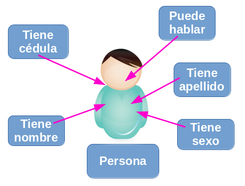

.. -*- coding: utf-8 -*-

.. _python_poo_herencia:

Herencia
--------

La herencia es una de las premisas y técnicas de la :ref:`POO <python_poo>` la cual
permite a los programadores crear una clase general primero y luego más tarde crear
clases más especializadas que re-utilicen código de la clase general. La herencia
también le permite escribir un código más limpio y legible.

.. _python_poo_clase_base:

Clase Base
..........

Clase Base o también conocida como *Clase abstracta* le permite definir una clase que
puede heredarse en otras clases los atributos y comportamientos definido en esta.

    Clase base o abstracta

Use el diagrama anterior para ilustrar el concepto de la herencia, vea el caso de
dos clases que tiene algo en común, ambas son personas, con atributos de datos
personales y comportamiento típicos como hablar, comer, caminar, entonces para eso
se crea una clase base llamada ``Persona``. A continuación un ejemplo de la clase
``Persona`` con un método interno:

.. literalinclude:: ../../recursos/leccion9/clases.py
    :language: python
    :linenos:
    :lines: 4-36

En el ejemplo previo, es donde empieza a crear una clase (lo hace con la palabra
``class``). La segunda palabra ``Persona`` es el nombre de la clase. La tercera
palabra que se encuentra dentro de los paréntesis este hace referencia al objeto
:ref:`object <python_cls_object>`, usando para indicar la clase de la cual precede.

La clase ``Persona`` tiene los métodos ``__init__``, ``__str__``, ``hablar``
y ``obtener_genero``. Sus atributos son ``cedula``, ``nombre``, ``apellido`` y ``sexo``.

La instancia de dos nuevos objetos ``Persona`` seria de la siguiente forma:

.. literalinclude:: ../../recursos/leccion9/herencia_simple.py
    :language: python
    :linenos:
    :lines: 4-5

El método constructor ``__init__`` es un método especial el cual debe escribir como:
``MiClase(parámetros iniciales si hay cualquiera)``.

Usted puede llamar esos métodos y atributos con la siguiente notación:
``claseinstancia.metodo`` o ``claseinstancia.atributo``.

.. code-block:: pycon

    >>> print(persona1.nombre, persona1.apellido)
    >>> print(persona1.obtener_genero(persona1.sexo))

El método ``__str__`` es un método usando para imprimir la descripción de la instancia
de objeto el cual debe mostrar como:

.. literalinclude:: ../../recursos/leccion9/herencia_simple.py
    :language: python
    :linenos:
    :lines: 10

En el anterior código se usan para cierto formato para imprimir la instancia de objeto
usando la sentencia ``print``, concatenando el carácter ``\n`` para generar un salto
de página y seguidamente convertir a formato :ref:`cadena de caracteres <python_str>` usando la función
``str()`` a la instancia de objeto llamada ``persona2``.

.. _python_poo_herencia_simple:

Herencia simple
...............

La herencia simple se apoya en el uso de :ref:`clases base <python_poo_clase_base>`
para compartir sus atributos y comportamientos con otros clases derivadas como los
siguiente ejemplos el objeto ``Supervisor`` y el objeto ``Obrero``.

.. figure:: ../_static/images/poo_herencia.png
    :align: center
    :width: 70%

    Diagrama de herencia de Objetos

El siguiente es un ejemplo de la clase ``Supervisor`` que derivada de la clase
``Persona`` con función interna:

.. literalinclude:: ../../recursos/leccion9/clases.py
    :language: python
    :linenos:
    :lines: 39-64

Ahora, se creará una nueva clase ``Supervisor`` con los mismos métodos y atributos
como la clase ``Persona``, pero con dos nuevos atributos ``rol`` y ``tareas``.
No se copia la clase previa, pero si **se hereda** de ella.

La instancia del nuevo objeto ``Supervisor`` seria de la siguiente forma:

.. literalinclude:: ../../recursos/leccion9/herencia_simple.py
    :language: python
    :linenos:
    :lines: 58

Luego que genera la instancia del nuevo objeto ``Supervisor`` llamada ``supervisor1``
se puede imprimir sus detalles de la siguiente forma:

.. literalinclude:: ../../recursos/leccion9/herencia_simple.py
    :language: python
    :linenos:
    :lines: 63

Como la instancia de objeto ``supervisor1`` hereda los atributo(s) y método(s) de la
clase ``Persona`` usted puede reusarlo y llamarlo de la siguiente forma:

.. literalinclude:: ../../recursos/leccion9/herencia_simple.py
    :language: python
    :linenos:
    :lines: 66-75

Si desea usar los atributo(s) y método(s) heredados de la clase ``Supervisor`` se puede
imprimir de la siguiente forma:

.. literalinclude:: ../../recursos/leccion9/herencia_simple.py
    :language: python
    :linenos:
    :lines: 78-79

.. note::
    El uso de las clases y la programación orientada a objetos, le permite a usted que
    pueda organizar el código con diferentes clases correspondientes a diferentes objetos
    que encontrará (una clase ``Persona``, una clase ``Carro``, una clase ``Departamento``,
    etc.), con sus propios métodos y atributos. Luego puede usar la herencia para considerar
    las variaciones en torno a una clase base y reutilizar el código. Ej.: a partir de una
    clase base de ``Persona``, usted puede crear clases derivadas como ``Supervisor``,
    ``JefeCuadrilla``, ``Obrero``, etc.

.. literalinclude:: ../../recursos/leccion9/herencia_simple.py
    :language: python
    :linenos:
    :lines: 62-68

Función issubclass()
~~~~~~~~~~~~~~~~~~~~

``issubclass()``, es una :ref:`función integrada <python_fun_builtins>` la cual le
permite corroborar si un objeto es instancia de una clase.

.. note::
    Más información consulte la documentación detallada de la función
    :ref:`issubclass() <python_fun_issubclass>`.

.. important::
    Usted puede descargar el código usado en esta sección haciendo clic en los
    siguientes enlaces: :download:`clases.py <../../recursos/leccion9/clases.py>`
    y :download:`herencia_simple.py <../../recursos/leccion9/herencia_simple.py>`.

.. tip::
    Para ejecutar el código :file:`clases.py` y :file:`herencia_simple.py`,
    abra una consola de comando, acceda al directorio donde se encuentra ambos programas:

    ::

        leccion9/
        ├── clases.py
        └── herencia_simple.py

    Si tiene la estructura de archivo previa, entonces ejecute el siguiente comando:

    .. code-block:: console

        $ python herencia_simple.py

.. _python_poo_herencia_multiple:

Herencia múltiple
.................

A diferencia de lenguajes como *Java* y *C#*, el lenguaje *Python* permite la herencia
múltiple, es decir, se puede heredar de múltiples clases.

La herencia múltiple es la capacidad de una subclase de heredar de múltiples súper
clases.

Esto conlleva un problema, y es que si varias súper clases tienen los mismos atributos
o métodos, la subclase sólo podrá heredar de una de ellas.

En estos casos Python dará prioridad a las clases más a la izquierda en el momento de
la declaración de la subclase:

.. literalinclude:: ../../recursos/leccion9/clases.py
    :language: python
    :linenos:
    :lines: 59-96

.. _python_poo_herencia_multiple_mro:

Method Resolution Order (MRO)
~~~~~~~~~~~~~~~~~~~~~~~~~~~~~
Ese es el orden en el cual el método debe heredar en la presencia de herencia múltiple.
Usted puede ver el MRO usando el atributo ``__mro__``.

.. code-block:: pycon

    >>> JefeCuadrilla.__mro__
    (<class '__main__.JefeCuadrilla'>,
    <class '__main__.Supervisor'>,
    <class '__main__.Persona'>,
    <class '__main__.Destreza'>,
    <type 'object'>)

    >>> Supervisor.__mro__
    (<class '__main__.Supervisor'>,
    <class '__main__.Persona'>,
    <type 'object'>)

    >>> Destreza.__mro__
    (<class '__main__.Destreza'>,
    <type 'object'>)

El *MRO* es calculado en Python de la siguiente forma:

Un método en la llamada derivada es siempre llamada antes de método de la clase base.
En nuestro ejemplo, la clase ``JefeCuadrilla`` es llamada antes de las clases
``Supervisor`` o ``Destreza``. Esas dos clases son llamada antes de
la clase ``Persona`` y la clase ``Persona`` es llamada antes de la clase ``object``.

Si hay herencia múltiple como ``JefeCuadrilla(Supervisor, Destreza)``, el método invoca
a ``Supervisor`` primero por que ese aparece primero de izquierda a derecha.

.. important::
    Usted puede descargar el código usado en esta sección haciendo clic en los
    siguientes enlaces: :download:`clases.py <../../recursos/leccion9/clases.py>`
    y :download:`herencia_multiple.py <../../recursos/leccion9/herencia_multiple.py>`.

.. tip::
    Para ejecutar el código :file:`clases.py` y :file:`herencia_multiple.py`,
    abra una consola de comando, acceda al directorio donde se encuentra ambos programas:

    ::

        leccion9/
        ├── clases.py
        └── herencia_multiple.py

    Si tiene la estructura de archivo previa, entonces ejecute el siguiente comando:

    .. code-block:: console

        $ python herencia_multiple.py

.. seealso::

    Consulte la sección de :ref:`lecturas suplementarias <lectura_extras_leccion9>`
    del entrenamiento para ampliar su conocimiento en esta temática.

.. raw:: html
   :file: ../_templates/partials/soporte_profesional.html

.. disqus::
