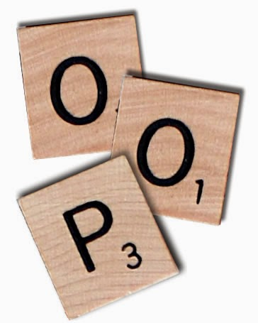

.. -*- coding: utf-8 -*-

.. _python_poo:

Programación orientada a objetos
--------------------------------

La programación orientada a objetos (POO, u OOP según sus siglas 
en inglés) es un paradigma de programación que viene a innovar la 
forma de obtener resultados. Los objetos manipulan los datos de 
entrada para la obtención de datos de salida específicos, donde 
cada objeto ofrece una funcionalidad especial.

Muchos de los objetos prediseñados de los lenguajes de programación 
actuales permiten la agrupación en bibliotecas o librerías, sin 
embargo, muchos de estos lenguajes permiten al usuario la creación 
de sus propias bibliotecas.

    Programación Orientada a Objetos - POO

Está basada en varias técnicas, como las siguientes:

- :ref:`herencia <python_poo_herencia>`.

- cohesión.

- :ref:`abstracción <python_poo_abstraccion>`.

- :ref:`polimorfismo <python_poo_polimorfismo>`.

- acoplamiento.

- :ref:`encapsulación <python_poo_encapsulacion>`.

La POO tiene sus raíces en la década del 60 con el lenguaje de programación 
Simula que en 1967, el cual fue el primer lenguaje que posee las 
características principales de un lenguaje orientado a objetos. 

Smalltalk (de 1972 a 1980) es posiblemente el ejemplo canónico, y 
con el que gran parte de la teoría de la POO se ha desarrollado. Más su uso 
se popularizó a principios de la década de 1990. 

En la actualidad, existe una gran variedad de lenguajes de programación 
que soportan la orientación a objetos.

Los objetivos de la POO son:

- Organizar el código fuente, y

- re-usar código fuente en similares contextos.

.. note:: 
    Más información consulte el articulo `Programación orientada a objetos - Wikipedia <https://es.wikipedia.org/wiki/Programaci%C3%B3n_orientada_a_objetos>`_.

----

POO en Python
.............

El mecanismo de clases de Python agrega clases al lenguaje con 
un mínimo de nuevas sintaxis y semánticas. 

En Python las clases es una mezcla de los mecanismos de clase 
encontrados en ``C++`` y ``Modula-3``. 

Como es cierto para los módulos, las clases en Python no ponen 
una barrera absoluta entre la definición y el usuario, sino que
más bien se apoya en la cortesía del usuario de no "forzar la 
definición". 

Sin embargo, se mantiene el poder completo de las características 
más importantes de las clases: el mecanismo de la herencia de 
clases permite múltiples clases base, una clase derivada puede 
sobrescribir cualquier método de su(s) clase(s) base, y un método 
puede llamar al método de la clase base con el mismo nombre.

    *"Los objetos pueden tener una cantidad arbitraria de datos."*

En terminología de ``C++``, todos los miembros de las clases (incluyendo 
los miembros de datos), son *públicos*, y todas las funciones 
miembro son *virtuales*. 

Como en ``Modula-3``, no hay atajos para hacer referencia a los 
miembros del objeto desde sus métodos: la función método se declara 
con un primer argumento explícito que representa al objeto, el cual 
se provee implícitamente por la llamada. 

Como en ``Smalltalk``, las clases mismas son objetos. Esto provee 
una semántica para importar y renombrar. 

A diferencia de ``C++`` y ``Modula-3``, los tipos de datos integrados 
pueden usarse como clases base para que el usuario los extienda. 

También, como en ``C++`` pero a diferencia de ``Modula-3``, la mayoría 
de los operadores integrados con sintaxis especial (operadores aritméticos, 
de subíndice, etc.) pueden ser redefinidos por instancias de la clase.

(Sin haber una terminología universalmente aceptada sobre clases, 
haré uso ocasional de términos de ``Smalltalk`` y ``C++``. Usaría términos 
de ``Modula-3``, ya que su semántica orientada a objetos es más cercana 
a Python que ``C++``, pero no espero que muchos lectores hayan escuchado 
hablar de él).

Algunas particularidades de POO en Python son las siguientes:

- Todo es un objeto, incluyendo los tipos y clases.

- Permite herencia múltiple.

- No existen métodos ni atributos privados.

- Los atributos pueden ser modificados directamente.

- Permite "monkey patching".

- Permite "duck typing".

- Permite la sobrecarga de operadores.

- Permite la creación de nuevos tipos de datos.

A continuación se procede a definir algunos conceptos necesarios para entender la POO:

.. _python_objetos:

Objetos
.......

Los objetos son la clave para entender la :ref:`Programación Orientada a Objetos <python_poo>`. 
Si mira a nuestro alrededor encontrará un sin fin de objetos de la vida real: 
perro, escritorio, televisor, bicicleta, etc...

En Python puede definir una clase con la palabra reservada ``class``, de 
la siguiente forma:

::

    class Persona:
        pass

En el ejemplo anterior, el nombre de la clase es ``Persona`` y dentro 
del bloque de código usa la sentencia :ref:`pass <python_sentencia_pass>`. 
Aunque no es requerido por el intérprete, los nombres de las clases se 
escriben por convención capitalizadas. Las clases pueden (y siempre 
deberían) tener comentarios.

.. figure:: ../_static/objetos_clases.png
    :align: center
    :width: 50%

    Diagrama de Objeto Persona

.. _python_atributos:

Atributos
.........

Los atributos o propiedades de los objetos son las características 
que puede tener un objeto, como el color. Si el objeto fuera ``Persona``, 
los atributos podrían ser: ``cedula``, ``nombre``, ``apellido``, ``sexo``, 
etc...

Los atributos describen el estado de un objeto. Pueden ser de cualquier 
tipo de dato.

.. literalinclude:: ../../recursos/leccion9/poo.py
    :language: python
    :lines: 3-8

Usted puede probar el código anterior, si lo transcribe en el 
:ref:`consola interactiva <python_interactivo>` de Python como lo siguiente:

::

    >>> class Persona:
    ...     """ Representa una persona real """
    ...     cedula = "V-13458796"
    ...     nombre = "Leonardo"
    ...     apellido = "Caballero"
    ...     sexo = "M"
    ... 
    >>> macagua = Persona
    >>> type(macagua)
    <type 'classobj'>
    >>> macagua.__name__
    'Persona'
    >>> macagua.__doc__
    ' Representa una persona real '
    >>> dir(macagua)
    ['__doc__', '__module__', 'apellido', 'cedula', 'nombre', 'sexo']
    >>> macagua.cedula
    'V-13458796'
    >>> macagua.nombre
    'Leonardo'
    >>> macagua.apellido
    'Caballero'
    >>> macagua.sexo
    'M'
    >>> print "El objeto de la clase " + macagua.__name__ +"," \
    ... + macagua.__doc__ + "."
    El objeto de la clase Persona, Representa una persona real .
    >>> print "Hola, mucho gusto, mi nombre es '"+ \
    ... macagua.nombre +" "+ \
    ... macagua.apellido +"', \nmi cédula de identidad es '"+  \
    ... macagua.cedula +"', y mi sexo es '"+  \
    ... macagua.sexo +"'."
    Hola, mucho gusto, mi nombre es 'Leonardo Caballero', 
    mi cédula de identidad es 'V-13458796', y mi sexo es 'M'.
    >>> 

.. _python_metodos:

Métodos
.......

Los métodos describen el comportamiento de los objetos de una clase. Estos 
representan las operaciones que se pueden realizar con los objetos de la clase, 

La ejecución de un método puede conducir a cambiar el estado del objeto.

Se definen de la misma forma que las funciones normales pero deben declararse dentro 
de la clase y su primer argumento siempre referencia a la instancia que lo invoca, 
de esta forma se afirma que los métodos son :ref:`funciones <python_funciones>`, 
adjuntadas a :ref:`objectos <python_objetos>`.

.. note:: 
    Usted puede encontrar ejemplos en las funciones de :ref:`cadena de caracteres <python_cadenas>`, 
    :ref:`listas <python_listas>`, :ref:`diccionarios <python_diccionarios>`, etc. 

Si el objeto es ``Persona``, los métodos pueden ser: ``hablar``, ``caminar``, 
``comer``, ``dormir``, etc. 

.. literalinclude:: ../../recursos/leccion9/poo.py
    :language: python
    :lines: 3-12

Usted puede probar el código anterior, si lo transcribe en el 
:ref:`consola interactiva <python_interactivo>` de Python como lo siguiente:

::

    >>> class Persona:
    ...     """ Representa una persona real """
    ...     cedula = "V-13458796"
    ...     nombre = "Leonardo"
    ...     apellido = "Caballero"
    ...     sexo = "M"
    ...     
    ...     def hablar(self, mensaje):
    ...         """ Mostrar mensaje de saludo de Persona """
    ...         return mensaje
    ... 
    >>> Persona().hablar("Hola, soy la clase {0}.".format(macagua.__name__))
    'Hola, soy la clase Persona.'
    >>> 

Si creo una instancia de objeto para la clase ``Persona`` lanzara una excepción 
:ref:`TypeError <python_exception_typeerror>`, como sucede a continuación:

::

    >>> macagua = Persona
    >>> macagua.hablar("Hola Python")
    Traceback (most recent call last):
      File "<stdin>", line 1, in <module>
    TypeError: unbound method hablar() must be called with Persona instance as first argument (got str instance instead)

Esto sucede por...

.. todo:: TODO explicar por que se lanza la excepción TypeError.

.. _python_clases:

Clases
......

Las clases definen las características del :ref:`objeto <python_objetos>`.

Con todos los conceptos anteriores explicados, se puede decir que 
una clase es una plantilla genérica de un :ref:`objeto <python_objetos>`. 
La clase proporciona variables iniciales de estado (donde se guardan los 
:ref:`atributos <python_atributos>`) e implementaciones de comportamiento 
(:ref:`métodos <python_metodos>`) necesarias para crear nuevos objetos, son 
los modelos sobre los cuáles serán construidos.

.. _python_instancias:

Instancias
..........

Ya sabe que una clase es una estructura general del objeto. Por ejemplo, puede 
decir que la clase ``Persona`` necesita tener una ``cedula``, un ``nombre``, 
un ``apellido`` y una ``sexo``, pero no va a decir cual es ``cedula``, ``nombre``, 
``apellido`` y ``sexo``, es aquí donde entran las instancias. Una instancia es una 
copia específica de la clase con todo su contenido.

Ejemplo: Leonardo = Persona (13567098, "Leonardo", "Caballero", "M")

Aquí puede decir que ``Leonardo`` es una instancia de la clase 
``Persona``.

Las clases dan la posibilidad de crear estructuras de datos más complejas. En el 
ejemplo, cree una clase ``Persona`` que realizará un seguimiento del ``cedula``, 
``nombre``, ``apellido`` y ``sexo`` (que pasará como atributos).

----

.. seealso::

    Consulte la sección de :ref:`lecturas suplementarias <lecturas_suplementarias_sesion9>` 
    del entrenamiento para ampliar su conocimiento en esta temática.
