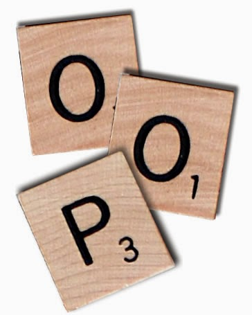

.. -*- coding: utf-8 -*-


.. _python_poo:

Programación orientada a objetos
--------------------------------

La programación orientada a objetos (POO, u OOP según sus siglas en inglés) es un
paradigma de programación que viene a innovar la forma de obtener resultados. Los
objetos manipulan los datos de entrada para la obtención de datos de salida específicos,
donde cada objeto ofrece una funcionalidad especial.

Muchos de los objetos prediseñados de los lenguajes de programación actuales permiten
la agrupación en bibliotecas o librerías, sin embargo, muchos de estos lenguajes
permiten al usuario la creación de sus propias bibliotecas.



    Programación Orientada a Objetos - POO

Está basada en varias técnicas, como las siguientes:

- :ref:`herencia <python_poo_herencia>`.

- cohesión.

- :ref:`abstracción <python_poo_abstraccion>`.

- :ref:`polimorfismo <python_poo_polimorfismo>`.

- acoplamiento.

- :ref:`encapsulación <python_poo_encapsulacion>`.


La POO tiene sus raíces en la década del 60 con el lenguaje de programación ``Simula``
que en 1967, el cual fue el primer lenguaje que posee las características principales
de un lenguaje orientado a objetos.

Smalltalk (de 1972 a 1980) es posiblemente el ejemplo canónico, y con el que gran
parte de la teoría de la POO se ha desarrollado. Más su uso se popularizó a principios
de la década de 1990.

En la actualidad, existe una gran variedad de lenguajes de programación que soportan
la orientación a objetos.

Los objetivos de la POO son:

- Organizar el código fuente, y

- re-usar código fuente en similares contextos.

.. note::
    Más información consulte el articulo de Wikipedia
    `Programación orientada a objetos <https://es.wikipedia.org/wiki/Programaci%C3%B3n_orientada_a_objetos>`_.


POO en Python
.............

El mecanismo de clases de Python agrega clases al lenguaje con un mínimo de nuevas
sintaxis y semánticas.

En Python las clases es una mezcla de los mecanismos de clase encontrados en ``C++``
y ``Modula-3``.

Como es cierto para los módulos, las clases en Python no ponen una barrera absoluta
entre la definición y el usuario, sino que más bien se apoya en la cortesía del usuario
de no "forzar la definición".

Sin embargo, se mantiene el poder completo de las características más importantes
de las clases: el mecanismo de la herencia de clases permite múltiples clases base,
una clase derivada puede sobrescribir cualquier método de su(s) clase(s) base, y
un método puede llamar al método de la clase base con el mismo nombre.

    *"Los objetos pueden tener una cantidad arbitraria de datos."*

En terminología de ``C++``, todos los miembros de las clases (incluyendo los miembros
de datos), son *públicos*, y todas las funciones miembro son *virtuales*.

Como en ``Modula-3``, no hay atajos para hacer referencia a los miembros del objeto
desde sus métodos: la función método se declara con un primer argumento explícito
que representa al objeto, el cual se provee implícitamente por la llamada.

Como en ``Smalltalk``, las clases mismas son objetos. Esto provee una semántica para
importar y renombrar.

A diferencia de ``C++`` y ``Modula-3``, los tipos de datos integrados pueden usarse
como clases base para que el usuario los extienda.

También, como en ``C++`` pero a diferencia de ``Modula-3``, la mayoría de los operadores
integrados con sintaxis especial (operadores aritméticos, de subíndice, etc.) pueden ser
redefinidos por instancias de la clase.

(Sin haber una terminología universalmente aceptada sobre clases, haré uso ocasional de
términos de ``Smalltalk`` y ``C++``. Usaría términos de ``Modula-3``, ya que su semántica
orientada a objetos es más cercana a Python que ``C++``, pero no espero que muchos lectores
hayan escuchado hablar de él).

Algunas particularidades de POO en Python son las siguientes:

- Todo es un objeto, incluyendo los tipos y clases.

- Permite herencia múltiple.

- No existen métodos ni atributos privados.

- Los atributos pueden ser modificados directamente.

- Permite "monkey patching".

- Permite "duck typing".

- Permite la sobrecarga de operadores.

- Permite la creación de nuevos tipos de datos.

A continuación se procede a definir algunos conceptos necesarios para entender la POO:


.. _python_objetos:

Objetos
.......

Los *objetos* son abstracción de Python para data. Toda la data en un programa Python
es representado por objectos o por relaciones entre objectos. (En cierto sentido, y en
el código modelo de Von Neumann de una "computadora almacenada del programa" también es
un código representado por los objetos.)

Cada objeto tiene una identidad, un tipo y un valor. Una identidad de objecto nunca
cambia una vez es creada; usted puede pensar eso como la dirección de objeto en memoria.
El operador :ref:`in <python_opers_in>` compara la identidad de dos objetos; la función
:ref:`id() <python_fun_id>` devuelve un número entero representando la identidad (actualmente
implementado como su dirección).

El *tipo* de un objeto también es inmutable. El tipo de un objeto determina las
operaciones que admite el objeto (por ejemplo, "¿tiene una longitud?") Y también define
los valores posibles para los objetos de ese tipo. La función ":ref:`type() <python_fun_type>`"
devuelve el tipo de un objeto (que es un objeto en sí mismo). El *valor* de algunos
objetos puede cambiar. Se dice que los objetos cuyo valor puede cambiar son *mutables*;
los objetos cuyo valor no se puede cambiar una vez que se crean se llaman *immutable*.
(El valor de un objeto contenedor inmutable que contiene una referencia a un objeto mutable
puede cambiar cuando se cambia el valor de este último; sin embargo, el contenedor todavía
se considera inmutable, porque la colección de objetos que contiene no se puede cambiar.
Por lo tanto, la inmutabilidad no es estrictamente lo mismo que tener un valor incambiable,
es más sutil.) La mutabilidad de un objeto está determinada por su tipo; por ejemplo,
los números, las cadenas y las tuplas son inmutables, mientras que los diccionarios y
las listas son mutables.

Los objetos son la clave para entender la :ref:`POO <python_poo>`. Si mira a nuestro
alrededor encontrará un sin fin de objetos de la vida real: perro, escritorio,
televisor, bicicleta, etc...

En Python puede definir una clase con la palabra reservada :ref:`class <python_clases>`,
de la siguiente forma:

::

    class Persona:
        pass

En el ejemplo anterior, el nombre de la clase es ``Persona`` y dentro del bloque de
código usa la sentencia :ref:`pass <python_sent_pass>`. Aunque no es requerido por
el intérprete, los nombres de las clases se escriben por convención capitalizadas.
Las clases pueden (y siempre deberían) tener comentarios.

.. figure:: ../_images/objetos_clases.png
    :align: center
    :width: 50%

    Diagrama de Objeto Persona


Estado de un objeto
~~~~~~~~~~~~~~~~~~~

El conjunto de datos y objetos relacionados con un objeto en un momento dado, se le
conoce como "estado". Un objeto puede tener múltiples estados a lo largo de su
existencia conforme se relaciona con su entorno y otros objetos.

.. todo:: TODO explicar el concepto Estado de un objeto.


.. _python_attrs:

Atributos
.........

Los atributos o propiedades de los objetos son las características que puede tener
un objeto, como el color. Si el objeto es ``Persona``, los atributos podrían ser:
``cedula``, ``nombre``, ``apellido``, ``sexo``, etc...

Los atributos describen el estado de un objeto. Pueden ser de cualquier tipo de dato.

.. literalinclude:: ../../recursos/leccion9/poo.py
    :language: python
    :lines: 1-6

Usted puede probar el código anterior, si lo transcribe en el
:ref:`consola interactiva <python_interactivo>` Python como lo siguiente:

::

    >>> class Persona:
    ...     """Clase que representa una Persona"""
    ...     cedula = "V-13458796"
    ...     nombre = "Leonardo"
    ...     apellido = "Caballero"
    ...     sexo = "M"
    ...
    >>> macagua = Persona
    >>> type(macagua)
    <type 'classobj'>
    >>> dir(macagua)
    ['__doc__', '__module__', 'apellido', 'cedula', 'nombre', 'sexo']
    >>> macagua.cedula
    'V-13458796'
    >>> macagua.nombre
    'Leonardo'
    >>> macagua.apellido
    'Caballero'
    >>> macagua.sexo
    'M'
    >>> print("El objeto de la clase " + macagua.__name__ +"," \
    ... + macagua.__doc__ + ".")
    El objeto de la clase Persona, Clase que representa una Persona.
    >>> print("Hola, mucho gusto, mi nombre es '"+ \
    ... macagua.nombre +" "+ \
    ... macagua.apellido +"', \nmi cédula de identidad es '"+  \
    ... macagua.cedula +"', y mi sexo es '"+  \
    ... macagua.sexo +"'.")
    Hola, mucho gusto, mi nombre es 'Leonardo Caballero',
    mi cédula de identidad es 'V-13458796', y mi sexo es 'M'.

Si el nombre de un atributo esta encerrado entre dobles guiones bajos son atributos
especiales.

- __name__, describe el nombre del objeto o del método.

::

    >>> macagua.__name__
    'Persona'

- __doc__, contiene la documentación de un módulo, una clase, o método especifico,
  escrita en el formato :ref:`docstrings <python_str_docstrings>`.

::

    >>> macagua.__doc__
    'Clase que representa una Persona'

Si el nombre de un atributo esta con dobles guiones bajos al principio son atributos
"escondidos". A continuación un pseudo código que ilustra un ejemplo:

::

    >>> ms_windows.__privado
    'True'

    >>> ms_windows.codigo_fuente.__no_tocar
    'True'

En la sección :ref:`encapsulación <python_poo_encapsulacion>` se describe esto a más
profundidad.


.. _python_metodos:

Métodos
.......

Los métodos describen el comportamiento de los objetos de una clase. Estos representan
las operaciones que se pueden realizar con los objetos de la clase,

La ejecución de un método puede conducir a cambiar el estado del objeto.

Se definen de la misma forma que las funciones normales pero deben declararse dentro
de la clase y su primer argumento siempre referencia a la instancia que la llama, de
esta forma se afirma que los métodos son
:ref:`funciones <python_funciones>`, adjuntadas a :ref:`objectos <python_objetos>`.

.. note::
    Usted puede encontrar ejemplos en las funciones de
    :ref:`cadena de caracteres <python_str>`, :ref:`listas <python_list>`,
    :ref:`diccionarios <python_dict>`, etc.

Si el objeto es ``Persona``, los métodos pueden ser: ``hablar``, ``caminar``,
``comer``, ``dormir``, etc.

.. literalinclude:: ../../recursos/leccion9/poo.py
    :language: python
    :lines: 1-10

La única diferencia sintáctica entre la definición de un método y la definición de una
función es que el primer parámetro del método por convención debe ser el nombre ``self``.

Usted puede probar el código anterior, si lo transcribe en el
:ref:`consola interactiva <python_interactivo>` Python como lo siguiente:

::

    >>> class Persona:
    ...     """Clase que representa una Persona"""
    ...     cedula = "V-13458796"
    ...     nombre = "Leonardo"
    ...     apellido = "Caballero"
    ...     sexo = "M"
    ...
    ...     def hablar(self, mensaje):
    ...         """Mostrar mensaje de saludo de Persona"""
    ...         return mensaje
    ...
    >>>
    >>> macagua = Persona
    >>> Persona().hablar("Hola, soy la clase {0}.".format(
    ...     macagua.__name__))
    'Hola, soy la clase Persona.'
    >>> type(Persona().hablar)
    <type 'instancemethod'>
    >>> Persona().hablar.__doc__
    'Mostrar mensaje de saludo de Persona'

Si crea una instancia de objeto para la clase ``Persona`` e intenta llamar al método
``hablar()`` esto lanzara una excepción :ref:`TypeError <python_exception_typeerror>`,
como sucede a continuación:

::

    >>> macagua = Persona
    >>> macagua.hablar("Hola Plone")
    Traceback (most recent call last):
      File "<stdin>", line 1, in <module>
    TypeError: unbound method hablar() must be called with Persona instance as first argument (got str instance instead)

Esto sucede por...

.. todo:: TODO explicar por que se lanza la excepción TypeError.


.. _python_mtd_ambito:

Ámbito de los métodos
~~~~~~~~~~~~~~~~~~~~~

Los métodos cuentan con un espacio de nombres propio. En caso de no encontrar un
nombre en su ámbito local, buscará en el ámbito superior hasta encontrar alguna
coincidencia.

Los métodos pueden acceder y crear atributos dentro del objeto al que pertenecen,
anteponiendo la palabra ``self`` y el operador de atributo "." antes del nombre
del atributo en cuestión.


.. _python_metodos_especiales:

Métodos especiales
~~~~~~~~~~~~~~~~~~

Las clases en Python cuentan con múltiples métodos especiales, los cuales se
encuentran entre dobles guiones bajos ``__<metodo>__()``.

Los métodos especiales más utilizados son :ref:`__init__() <python_mtd_init>`,
:ref:`__str__() <python_mtd_str>` y :ref:`__del__() <python_mtd_del>`.


.. _python_mtd_str:

__str__()
`````````

El método ``__str__()`` es un método especial, el cual se ejecuta al momento en el
cual un objeto se manda a mostrar, es decir es una cadena representativa de la clase,
la cual puede incluir formatos personalizados de presentación del mismo.

.. literalinclude:: ../../recursos/leccion9/clases.py
    :language: python
    :lines: 14-18


.. _python_mtd_del:

__del__()
`````````

El método ``__del__()`` es un método especial, el cual se ejecuta al momento en el
cual un objeto es descartado por el intérprete. El comportamiento de ``__del__()``
es muy similar a los "destructores" en otros lenguajes.


.. _python_mtd_classmethod:

Métodos de clase
~~~~~~~~~~~~~~~~

En ocasiones es necesario contar con métodos que interactúen con elementos de la clase
de la cual el objeto es instanciado. Python permite definir métodos de clase para esto.

Los métodos de clase son aquellos que están ligados directamente con los atributos
definidos en la clase que los contiene. Para definir un método de clase se utiliza el
decorador ``@classmethod`` y por convención se utiliza ``cls`` como argumento inicial
en lugar de ``self``.

Del mismo modo, los métodos de clase utilizan el prefijo ``cls`` para referirse a los
atributos de la clase.

::

    class <Clase>(object):
        ...
        ...
        @classmethod
        def <metodo>(cls, <argumentos>):
            ...
            ...


.. _python_mtd_staticmethod:

Métodos estáticos
~~~~~~~~~~~~~~~~~

Los métodos estáticos hacen referencia a las instancias y métodos de una clase. Para
definir un método estático se utiliza el decorador ``@staticmethod`` y no utiliza ningún
argumento inicial.

Al no utilizar ``self``, los métodos estáticos no pueden interactuar con los atributos
y métodos de la instancia.

Para referirse a los elementos de la clase, se debe utilizar el nombre de la clase como
prefijo.

::

    class <Clase>(object):
        ...
        ...
        @staticmethod
        def <metodo>(<argumentos>):
            ...
            ...


Interfaces
~~~~~~~~~~

La forma en que los métodos de un objeto pueden ser accedidos por otros objetos se
conoce como "interfaz". Una interfaz bien definida permite a objetos de distinta
índole interactuar entre sí de forma modular. La interfaz define el modo en que los
objetos intercambian información.

.. todo:: TODO explicar el concepto de Interfaces.


Implementaciones
~~~~~~~~~~~~~~~~

Una implementación corresponde al mecanismo interno que se desencadena en un método
cuando éste es llamado. Las implementaciones procesan las entradas proveniente de
las interfaces y actúan en consecuencia ya sea:

- Modificando el estado del objeto.

- Transfiriendo la información resultante del proceso interno a través de la
  interfaces.


.. todo:: TODO explicar el concepto de Implementaciones.


.. _python_clases:

Clases
......

Las clases definen las características del :ref:`objeto <python_objetos>`.

Con todos los conceptos anteriores explicados, se puede decir que una clase es una
plantilla genérica de un :ref:`objeto <python_objetos>`. La clase proporciona
variables iniciales de estado (donde se guardan los :ref:`atributos <python_attrs>`)
e implementaciones de comportamiento (:ref:`métodos <python_metodos>`) necesarias
para crear nuevos objetos, son los modelos sobre los cuáles serán construidos.


.. _python_instancias:

Instancias
..........

Ya sabe que una clase es una estructura general del objeto. Por ejemplo, puede decir
que la clase ``Persona`` necesita tener una ``cedula``, un ``nombre``, un ``apellido``
y una ``sexo``, pero no va a decir cual es ``cedula``, ``nombre``, ``apellido`` y
``sexo``, es aquí donde entran las instancias.

Una instancia es una copia específica de la clase con todo su contenido. Por ejemplo:

::

    >>> persona1 = Persona("V-13458796", "Leonardo", "Caballero", "M")
    Traceback (most recent call last):
      File "<stdin>", line 1, in <module>
    TypeError: this constructor takes no arguments

La excepción :ref:`TypeError <python_exception_typeerror>` indica que el *método
constructor no toma argumentos*, esto se debe a que la momento de definir la clase a
cada atributo se le asigno un valor (tipo de dato).

Usted puede definir el metodo constructor de la clase usando el método
:ref:`__init__() <python_mtd_init>`.


.. _python_mtd_init:

Método __init__()
~~~~~~~~~~~~~~~~~

El método ``__init__()`` es un método especial, el cual se ejecuta al momento de
instanciar un objeto. El comportamiento de ``__init__()`` es muy similar a los
**"constructores"** en otros lenguajes. Los argumentos que se utilizan en la
definición de ``__init__()`` corresponden a los parámetros que se deben ingresar
al instanciar un objeto.

.. literalinclude:: ../../recursos/leccion9/clases.py
    :language: python
    :lines: 7-12


Función isinstance()
~~~~~~~~~~~~~~~~~~~~

``isinstance()``, es una :ref:`función integrada <python_fun_builtins>` la cual le
permite corroborar si un objeto es instancia de una clase.

.. note::
    Más información consulte la documentación detallada de la función
    :ref:`isinstance() <python_fun_isinstance>`.


.. important::
    Usted puede descargar el código usado en esta sección haciendo clic
    :download:`aquí <../../recursos/leccion9/poo.py>`.


.. tip::
    Para ejecutar el código :file:`poo.py`, abra una consola de comando, acceda al
    directorio donde se encuentra el mismo, y ejecute el siguiente comando:

    ::

        python3 poo.py


.. seealso::

    Consulte la sección de :ref:`lecturas suplementarias <lectura_extras_sesion9>`
    del entrenamiento para ampliar su conocimiento en esta temática.


.. raw:: html
   :file: ../_templates/partials/soporte_profesional.html

.. disqus::
